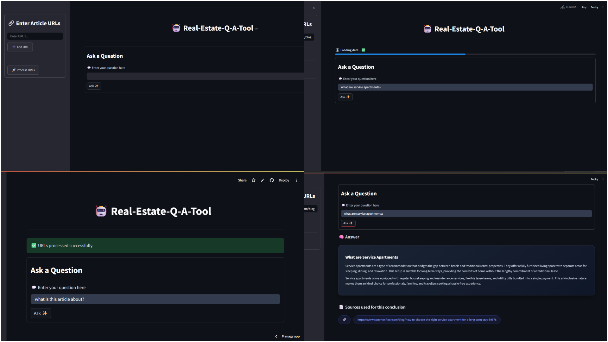

# 🏠 Real Estate Q&A Tool

An intelligent **Question & Answer system** that extracts and retrieves information from real estate websites using **LLMs, LangChain, and Vector Databases**.

---

## 🚀 Live Demo
👉 [Try the App Here](https://real-estate-q-a-tool.streamlit.app/)

---

## 📸 Demo Screenshots

### 💬 Q&A Output


---

## 📌 Project Overview

The Real Estate Q&A Tool allows users to:

* 🔍 Ask questions about property listings
* 🌐 Extract data from real estate websites
* 🤖 Get AI-powered answers using LLMs
* 📄 Retrieve relevant context using embeddings

This project uses a **Retrieval-Augmented Generation (RAG)** approach to ensure accurate and context-aware answers.

---

## 🧠 Tech Stack

* **Python**
* **LangChain**
* **ChromaDB (Vector Database)**
* **HuggingFace Embeddings**
* **BeautifulSoup (Web Scraping)**
* **Streamlit (UI)**
* **LLMs (Groq / Gemini / OpenAI)**

---

## ⚙️ Features

* ✅ URL-based data extraction
* ✅ Semantic search using embeddings
* ✅ Context-aware Q&A
* ✅ Fast retrieval with vector database
* ✅ Simple and interactive UI

---

## 📂 Project Structure

```
Real-Estate-Q-A-Tool/
│── rag.py               # Main RAG pipeline
│── app.py               # Streamlit UI
│── requirements.txt     # Dependencies
│── .env                 # API keys (not pushed)
│── chroma_db/           # Vector database storage
```

---

## 🛠️ Installation

### 1. Clone the repository

```
git clone https://github.com/thanusree2630/Real-Estate-Q-A-Tool.git
cd Real-Estate-Q-A-Tool
```

### 2. Create virtual environment

```
python -m venv venv
venv\Scripts\activate   # Windows
```

### 3. Install dependencies

```
pip install -r requirements.txt
```

### 4. Setup environment variables

Create a `.env` file:

```
GROQ_API_KEY=your_api_key_here
```

---

## ▶️ Usage

### Run the Streamlit app:

```
streamlit run main.py
```

### Steps:

1. Enter real estate website URLs
2. System scrapes and processes content
3. Ask questions related to properties
4. Get AI-generated answers instantly

---

## ⚠️ Known Issues

* Some websites use complex HTML structures (data not in `<p>` tags)
* Dynamic content may require advanced scraping techniques
* Limited accuracy if content extraction fails

---

## 🤝 Contributing

Contributions are welcome!
Feel free to fork the repo and submit a pull request.

---

## ⭐ Acknowledgements

* LangChain
* HuggingFace
* ChromaDB
* Streamlit

---

✨ *Built to simplify real estate data access using AI*
